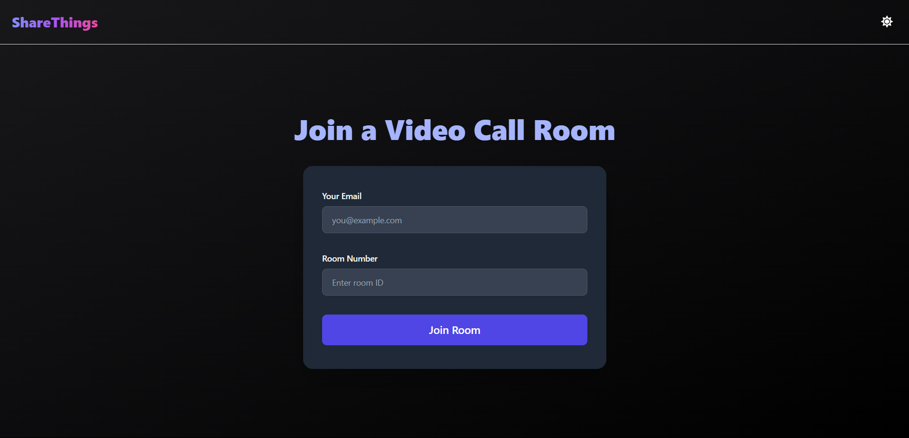
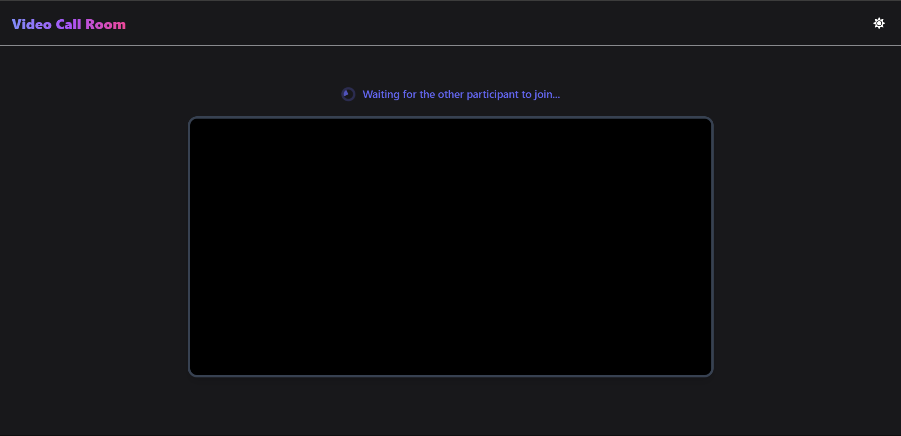
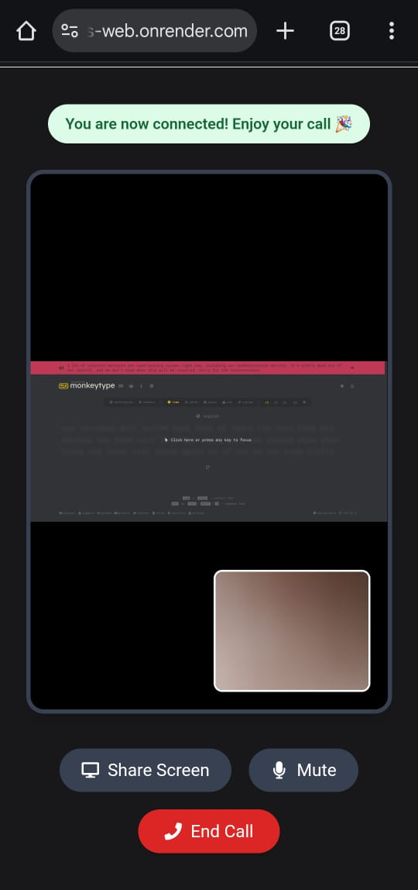

# 🚀 shareThings: Your P2P Screen Sharing & Video Calling Solution

Tired of complex video platforms and unreliable connections? **shareThings** brings you a seamless, peer-to-peer experience for real-time video calls and screen sharing—no middlemen, just direct connections for the fastest, most secure communication.

---

## 🔗 Live Demo

**shareThings** is deployed and available here:

> 🔗 **Live Website:** [shareThings Web](https://sharethings.onrender.com)

---

## 🔥 Key Features

- 🎥 **Real-Time Video Calling**: One-to-one video calls over WebRTC with adaptive quality.
- 🖥️ **Screen Sharing**: Share your entire screen or specific application windows effortlessly.
- 🤝 **Peer-to-Peer Connection**: Direct media streams via STUN/TURN for minimal latency and bandwidth usage.
- 🔐 **Secure Signaling**: Socket.IO with encrypted channels for session negotiation.
- ⚡ **Low Latency**: Optimized for smooth audio/video even on slower networks.
- 🌐 **Cross-Platform**: Works in modern browsers without plugins.

---

## 🧠 How It Works

1. **Signaling**: Socket.IO on Node.js/Express handles room management and signaling messages.
2. **Peer Connection**: WebRTC RTCPeerConnection establishes direct media streams with STUN/TURN servers for NAT traversal.
3. **Media Streams**: 
   - `getUserMedia` captures audio and video streams from the user's devices.
   - `getDisplayMedia` captures screen or application window streams for sharing.
   - `addTrack` attaches these media tracks to the RTCPeerConnection and sends them to the remote peer.
4. **UI**: React.js + Tailwind CSS provides a responsive, intuitive interface.

---

## ⚡ Quick Start


### Clone & Install

```bash
# Clone the repo
git clone https://github.com/MeetAghara512/ShareThings.git
cd ShareThings
```

The project uses a **client/server** structure:
```
ShareThings/
├── client/       # React frontend
└── server/       # Node.js/Socket.IO signaling backend
```

Install dependencies:
```bash
# Backend setup
cd server && npm install

# Frontend setup
cd client && npm install
```

Ensure you have set any required environment variables for the backend (e.g., `PORT`, `STUN_SERVERS`, `TURN_SERVERS`) in `/server/.env`.

---

## 📸 Screenshots
### Home Page
<p align="center">
  
</p>

### Wait for Connection
<p align="center">
  
</p>

### Connected (Mobile View)
<p align="center">
  
</p>


---

## 🔮 Future Enhancements

- 👥 **Multi-Party Calls** (group video & screen sharing)
- 💬 **In-Session Chat & File Transfer**
- 🎙️ **Call Recording & Playback**
- ✨ **Virtual Background & Blur Effects**
- 🔍 **Session Analytics & Usage Reports**

---

🎉 **shareThings – Screen, Stream, Succeed. Instant Collaboration! 🌐🎥**
